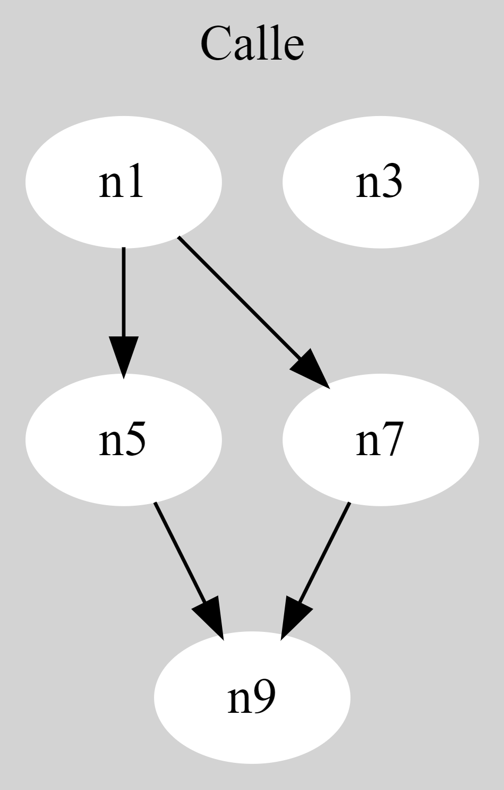
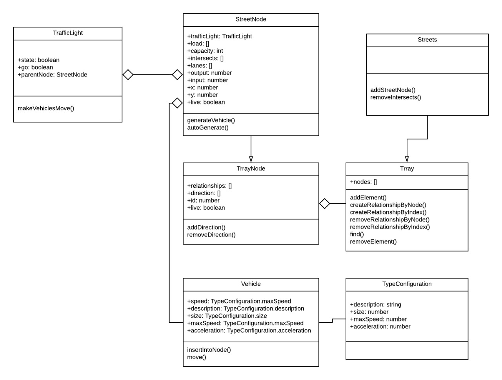

# Manejo de Trafico
En casi todos los países en vías de desarrollo la única manera de transporte es a través de la redes viales que se desarrollan de forma espontánea. Este trabajo presenta una simulación de redes viales de escala media a través de grafos dirigidos y colas, ofreciendo una solución de simulación liviana y sencilla.
## Depedencias
1. NodeJS
2. PaperJS
## Descargar y usar
### Descargar
```bash
git clone https://github.com/LinddM/manejo-trafico.git
```
### Usar
1. Descargar dependencias de Node
```bash
npm i
```
2. Abrir index.html

## Estructura de datos
### Digrafo


### Clases


## Simulador
### Calles
El modelo de calles es un grafo dirigido, donde cada vértice son 4 metros de calle y las aristas es la dirección de ese segmento. El modelo de las calles se puede representar por:
 
E ⊆ {(x, y) | (x, y) ∈ V2 ∧ x ≠ y}

Donde las calles son un conjunto de pares de segmentos relacionados con otro y no consigo mismo.

### Carriles
Los carriles están representados con colas en cada segmento de calle.
Cada segmento de calle contiene una colección de colas donde cada una es una lista de vehículos sobre ese segmento en punto del tiempo. La cantidad de colas es determinada por el número de carriles que tenga y la capacidad de cada cola individual por la unidad de tamaño de los vehículos dentro de la colección.

### Circulación
Los vehículos circulan a una determinada aceleración y velocidad máxima dependiendo del tipo que sean, y sólo continúan hacia la siguiente dirección en el grafo si hay espacio disponible. De no haber espacio o estar en un semáforo en rojo su velocidad regresa a cero y tiene que comenzar a acelerar otra vez cuando se desocupe la siguiente posición. Solo el primer carro en cada carril puede avanzar y desencolar, y cuando avanza a la siguiente posición va al final de la cola del siguiente carril.

## Saber más
Para ver más del proyecto y de la simulación los invitamos a leer el paper en 
[este repositorio](Manejo_y_Simulación_de_Redes_Viales_con_Grafos_Dirigidos.pdf)